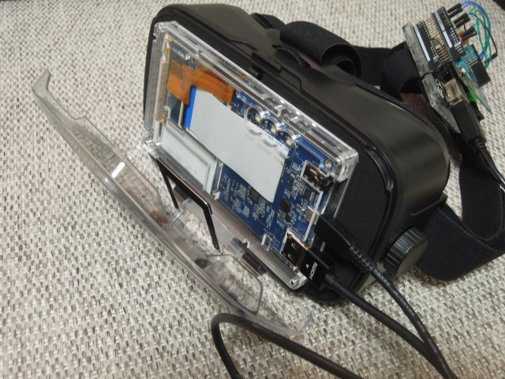

# 全天球カメラとVRゴーグルで、テレイグジスタンス体験(10)

[前ページ](./3dof.md) / [top](./top.md) / [次ページ](./complete.md)  

## 10. VRゴーグル組み上げ  

スマホ用のVRゴーグルが安価に手に入るので、それを活用  

### ■arduinoの貼り付け  
---

後頭部に来るVRゴーグルのバンド部分に、マジックテープで貼り付け  

  
  

### ■モニターケースの改造  
---

5.5インチ LCD用エンクロージャーの組み立ては、付属のマニュアル通りに行う。  
エンクロージャも含めて、スペック上では寸法的にピッタリ! と思いきや・・・ギリギリ閉まらない（笑）  

エンクロージャのアクリル6層に対し、  
* 表示側から1層目を、1mm厚の透明PET板に差し替え（DIYで切って、ネジ穴あけておく）  
* 表示側から5層目を、破棄  
* ネジをM3x12mmに変更（できるだけ頭が薄いもの）  

  

5mm程度薄くできた状態になるので、これでギリギリ閉まる状態に  
※ただし、ピッタリすぎて、蓋を手で開けれない。開けるときは、マイナスドライバでこじ開ける。  

  
  

### ■ラズパイとモバイルバッテリーの装着  
---

  

原宿で流行しているらしい（？）フィッシングベストを活用  
* 左胸ポケット：ラズパイ
* 右胸ポケット：モバイルバッテリー

  

※配線は適当に・・・  

[前ページ](./3dof.md) / [top](./top.md) / [次ページ](./complete.md)  

